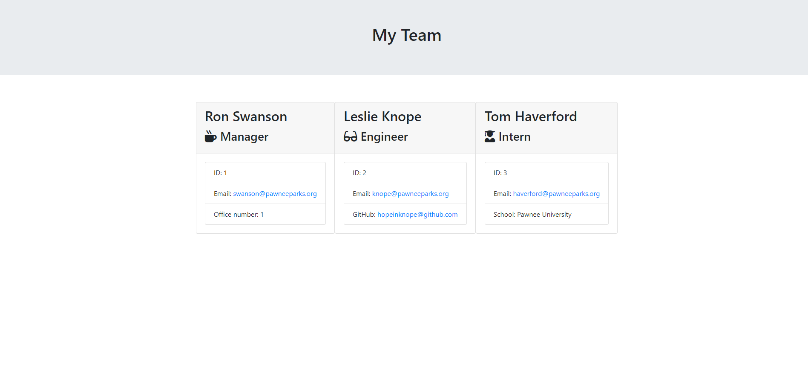

# 10 Object-Oriented Programming: Team Profile Generator

This is a command-line application that uses inquirer in order to generate a team profile. This application uses Node and generates the information into a HTML webpage that gives a brief summary of the employees who's information was received. 

## Installation

1. Clone this repository.
2. Run npm init -y, then npm install. This is for Node.js.

## Usage

Start application by typing node app.js into the command-line/terminal. 

Follow along with prompts to select type of employee.

Answer prompts to fill out information for Manager, Engineer(s), and Intern(s).

## Screenshot and Video

https://user-images.githubusercontent.com/79426119/123560429-09767800-d770-11eb-8f75-a4865527a85d.mp4

## Technology Used

1. JavaScript
2. HTML
3. CSS
4. Node.js

## Contributors

During the Rutgers Bootcamp, Kevin Ferguson, provided starter code. This project was also completed with the help of Reuben Genkin.
